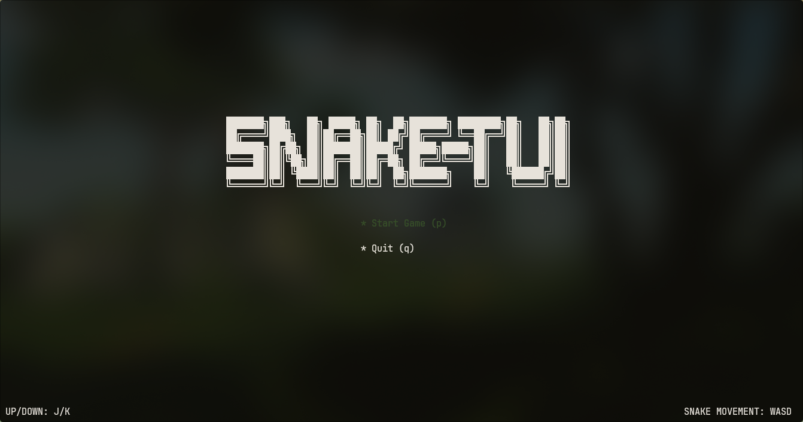
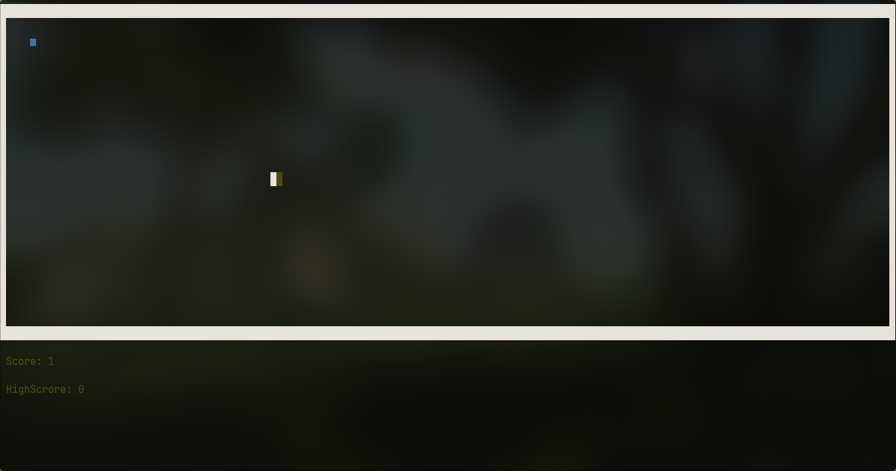

<div align="center">

# SNAKE-TUI

</div>

A Classic snake game witten in C++ for the Linux terminal.

## Game Preview

<table>
  <tr>
    <td width="50%"></td>
    <td width="50%"></td>
  </tr>

## Features
* **Game Play:** Classic snake gameplay.
* **Smooth Controls:** Optimized for Linux terminal input using termios.
* **HighScore:** Keeps track of your HighScore.
* **Obstacles:** After every 2 points obstacles are generated which you would need to avoid.

### How to Run

    ```bash 
    git clone git@github.com:Muhammad-Shahmeer-404/Snake-Game.git
    cd Snake-Game
    ./build.sh
    ./snaketui 
    ```
## Controls
* **Snake Movement:** WASD
* **Main Menu control:** j/k (up/down) Enter to select
